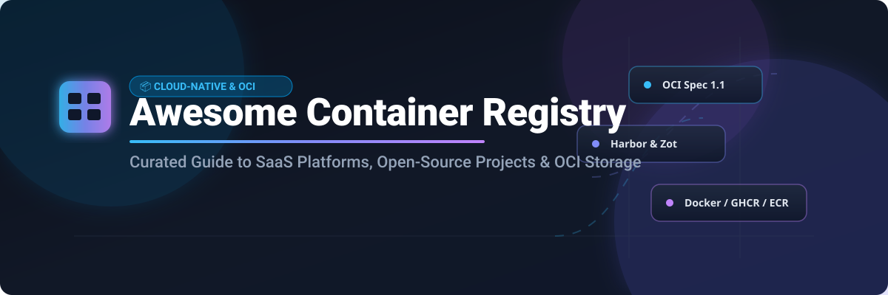

# 📦 Awesome Container Registry Ecosystem

     

---

## 🚀 Overview & Key Concepts

Welcome to the **Awesome Container Registry** guide! This repository curates the top **SaaS cloud platforms** and **open-source projects** for storing, managing, scanning, and distributing **OCI (Open Container Initiative) artifacts** and **Docker container images**.

Whether you are building enterprise DevSecOps pipelines on Kubernetes (EKS/GKE/AKS), self-hosting an air-gapped private registry, or configuring P2P image distribution across thousands of edge nodes, this guide provides side-by-side pricing, features, security scanning, and star-ranked open-source alternatives.

---

## 📑 Table of Contents

- [🌐 SaaS / Hosted Container Registries](#-saas--hosted-container-registries)
- [🔓 Open-Source GitHub Projects](#-open-source-github-projects)
- [🤝 How to Contribute](#-how-to-contribute)
- [💖 Support & Sponsorship](#-support--sponsorship)
- [📈 Star History](#-star-history)
- [⚠️ Disclaimer](#%EF%B8%8F-disclaimer)

---

## 🌐 SaaS / Hosted Container Registries

### 📊 Sector Market Size & Fragmentation Analysis

> [!NOTE]
> **Market Size & Outlook (2026):** The global Container Registry and Cloud Artifact Repository market is estimated at **~$3.2 Billion (USD)**, growing at a ~22.5% CAGR driven by widespread adoption of Kubernetes, cloud-native microservices, and automated DevSecOps pipelines.
> 
> **Market Structure:** The sector is **Moderately Fragmented / Cloud Hyperscaler Concentrated**. Public cloud workloads are predominantly dominated by hyperscalers (AWS ECR, Azure ACR, GCP Artifact Registry) and default image hubs (Docker Hub, GitHub GHCR). However, multi-cloud enterprises, air-gapped setups, and regulated security environments maintain strong demand for specialized registries (JFrog, Harbor, Quay, Sonatype).

### 🏆 SaaS Platforms Comparison Table

Below is the curated list of major SaaS container registry providers sorted by **Company Scale / Market Cap (Descending)**:

| Platform / Vendor | Description & Focus | Pricing (Starting Paid Tier) | Free Tier Limits | Company Scale / Market Cap |
| :--- | :--- | :--- | :--- | :--- |
| **[GitHub Container Registry (GHCR)](https://docs.github.com/en/packages/working-with-a-github-packages-registry/working-with-the-container-registry)** | Tightly integrated OCI package host linked with GitHub Repos, Actions, and granular permissions. | $0.25/GB storage & $0.50/GB data transfer (Free for public images) | 500 MB storage & 1 GB transfer/month included with Free GitHub account | **~$3.10 Trillion** *(Microsoft)* |
| **[Azure Container Registry (ACR)](https://azure.microsoft.com/en-us/products/container-registry/)** | Microsoft Azure-managed registry with geo-replication, ACR Tasks, and native AKS integration. | $0.167/day (~$5.00/month) for Basic Tier (10 GB storage included) | $200 free credit for 30 days via Azure Free Account | **~$3.10 Trillion** *(Microsoft)* |
| **[Google Artifact Registry](https://cloud.google.com/artifact-registry)** | GCP's unified registry supporting Docker/OCI, Helm, Maven, and npm with IAM control. | $0.10/GB per month storage + standard data transfer egress | 0.5 GB/month storage free forever + $300 free trial credits (90 days) | **~$2.10 Trillion** *(Alphabet)* |
| **[Amazon ECR](https://aws.amazon.com/ecr/)** | High-availability AWS container registry with IAM security, KMS encryption, & EKS integration. | $0.10/GB per month for private storage + standard AWS egress | 500 MB/month private storage for 12 months; 50 GB/month public storage free forever | **~$2.00 Trillion** *(Amazon)* |
| **[Quay.io](https://quay.io/)** | Red Hat's container registry featuring Clair vulnerability scanning and security auditing. | $15/month Developer Tier (up to 5 private repositories) | Unlimited public repositories free forever | **~$200 Billion** *(IBM / Red Hat)* |
| **[GitLab Container Registry](https://docs.gitlab.com/ee/user/packages/container_registry/)** | Native container repository embedded in GitLab CI/CD with security scanning pipelines. | $29/user/month (GitLab Premium Tier) | 5 GB storage & 10 GB transfer/month included on GitLab Free plan | **~$8.5 Billion** |
| **[JFrog Artifactory Cloud](https://jfrog.com/artifactory/)** | Universal artifact management platform supporting Docker, Helm, OCI, and 30+ package formats. | $150/month (Pro Cloud plan) or $0.09/GB-hr cloud consumption | 2 GB storage & 10 GB transfer/month free forever | **~$3.5 Billion** |
| **[Docker Hub](https://hub.docker.com/)** | The world's largest public container image registry—default for Docker CLI and official images. | $5/user/month (Personal/Pro plan billed annually) or $7/mo monthly | Unlimited public repos, 1 private repo, 200 pulls per 6 hours (authenticated) | **~$2.1 Billion** *(Private)* |
| **[Nexus Repository Cloud](https://www.sonatype.com/products/sonatype-nexus-repository)** | Sonatype's enterprise repository manager with container image hosting and software supply chain security. | $120/user/year (~$10/user/month) for Sonatype Nexus Pro | Unlimited free usage with self-hosted Nexus Repository OSS edition | **~$1.5 Billion** *(Private)* |

---

## 🔓 Open-Source GitHub Projects

Container registries boast a rich open-source ecosystem. Self-hosting enables data sovereignty, air-gapped security, zero cost at scale, and custom RBAC policies.

The projects below are sorted by **GitHub Stars_Count (Descending)**:

| Rank | Project Name | Description & Key Features | Stars_Badge (Link to Stargazers) |
| :---: | :--- | :--- | :---: |
| 1 | **[Harbor](https://github.com/goharbor/harbor)** | **CNCF Graduated** enterprise-grade cloud-native registry. Features RBAC, vulnerability scanning (Trivy), image signing (Cosign/Notary), policy management, and cross-registry replication. |  |
| 2 | **[Skopeo](https://github.com/containers/skopeo)** | Command-line utility that performs operations on container images and registries (copy, inspect, delete, sign) without requiring a running Docker daemon. |  |
| 3 | **[Clair](https://github.com/quay/clair)** | Open-source vulnerability parsing, tracking, and static analysis engine for container images. Frequently integrated with Quay and Harbor. |  |
| 4 | **[Distribution](https://github.com/distribution/distribution)** | **CNCF Project** providing the reference implementation of the OCI Distribution Specification. Serves as the foundation for Docker Hub and many custom registries. |  |
| 5 | **[Kraken](https://github.com/uber/kraken)** | P2P Docker registry developed by Uber, optimized for distributing terabytes of image data in seconds across thousands of hosts in large-scale clusters. |  |
| 6 | **[Cosign](https://github.com/sigstore/cosign)** | Container signing, verification, and storage in OCI registries. Part of the Sigstore project for securing software supply chains. |  |
| 7 | **[go-containerregistry](https://github.com/google/go-containerregistry)** | Google's Go library and CLI toolkit (`crane`) for interacting with OCI registries, building images, and inspecting remote image manifests. |  |
| 8 | **[Spegel](https://github.com/spegel-org/spegel)** | Stateless P2P OCI registry for Kubernetes. Enables nodes to share container images directly without external registry network overhead. |  |
| 9 | **[Docker Registry UI](https://github.com/Joxit/docker-registry-ui)** | User-friendly web user interface for private Docker `distribution` registries with image search, tag deletion, and multi-registry management. |  |
| 10 | **[Dragonfly 2](https://github.com/dragonflyoss/Dragonfly2)** | **CNCF Incubating** peer-to-peer file and image distribution system. Speeds up large container image downloads across Kubernetes clusters. |  |
| 11 | **[Project Quay](https://github.com/quay/quay)** | Open-source container registry codebase behind Quay.io. Includes built-in access control, Clair security integration, and geo-replication. |  |
| 12 | **[Zot Registry](https://github.com/project-zot/zot)** | Production-ready, OCI-native container registry designed for micro-services, edge devices, and cloud deployments with low resource footprint. |  |
| 13 | **[Nexus Repository OSS](https://github.com/sonatype/nexus-public)** | Open-source binary repository manager supporting Docker/OCI container images along with Java (Maven), Python (PyPI), and JavaScript (npm). |  |

---

## 🤝 How to Contribute

Contributions from platform engineers, DevOps practitioners, and open-source enthusiasts are welcome!

1. 🍴 **Fork** this repository.
2. 📝 Add or update entries in `README.md` following the tabular format.
3. 🔍 Ensure accurate pricing, free tier details, official website links, and GitHub stargazers links.
4. 🚀 Submit a **Pull Request** with a clear explanation of your changes.

For curated lists guidelines, explore [Awesome Awesome Awesome](https://github.com/ishandutta2007/Awesome-Awesome-Awesome).

---

## 💖 Support & Sponsorship

If you find this Container Registry Ecosystem list useful for your infrastructure planning or research, please consider supporting the project:

- ⭐ **Star** this repository to increase visibility!
- 🔀 **Fork** and share with your DevOps & Platform Engineering teams.
- ☕ **Buy me a coffee / Sponsor**: Support ongoing maintenance via [GitHub Sponsors](https://github.com/sponsors/ishandutta2007).

---

## 📈 Star History

---

## ⚠️ Disclaimer

This repository is a community-curated collection intended for educational and informational purposes. Pricing, free tier limits, and valuations are subject to change by vendors. Always refer to official provider documentation for binding commercial SLA and pricing terms.
